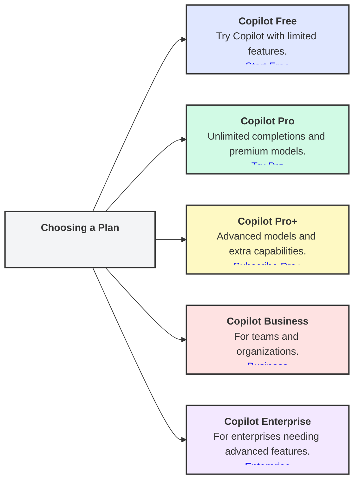

# GitHub Copilot Subscription Plans

GitHub Copilot offers several subscription plans tailored to individual developers, teams, and enterprises. Each plan provides different levels of access, features, and usage limits. Below is an overview of the available plans as of June 2025.

## Copilot Plans Comparison

  | Plan                | Who it's for                                                                 | Features                                                                                                                                         | Cost                                  |
  |---------------------|------------------------------------------------------------------------------|--------------------------------------------------------------------------------------------------------------------------------------------------|---------------------------------------|
  | **Copilot Free**    | Individual developers not using Copilot through an organization or enterprise | - Limited access to select Copilot features - 2,000 code completions/month - 50 chat messages/month                                        | Free                                  |
  | **Copilot Pro**     | Individuals who want more flexibility and advanced features                   | - Unlimited code completions - Access to premium models in Copilot Chat - Copilot coding agent - 300 premium requests/month - Free for eligible students, teachers, and open source maintainers | $10 USD/month $100 USD/year (free for some users) |
  | **Copilot Pro+**    | Power users who need the most advanced capabilities                          | - Everything in Copilot Pro - 1,500 premium requests/month - Full access to all available models in Copilot Chat - Extended request limits and extra capabilities | $39 USD/month $390 USD/year        |
  | **Copilot Business**| Organizations on GitHub Free, Team, or Enterprise Cloud                      | - Copilot coding agent - Centralized management and Copilot policy control - 300 premium requests/user/month                               | $19 USD per granted seat/month        |
  | **Copilot Enterprise** | Enterprises using GitHub Enterprise Cloud                                 | - All features of Copilot Business - Additional enterprise-grade capabilities - 1,000 premium requests/user/month                          | $39 USD per granted seat/month        |

## Feature Comparison

| Feature                | Free                | Pro                  | Pro+                 | Business             | Enterprise           |
|------------------------|---------------------|----------------------|----------------------|----------------------|----------------------|
| **Code Completion**    | 2,000/month         | Unlimited            | Unlimited            | Unlimited            | Unlimited            |
| **Copilot Chat**       | 50 messages/month   | Unlimited1| Unlimited2| Unlimited1| Unlimited1|
| **Premium Requests**   | Not included        | 300/month            | 1,500/month          | 300/user/month       | 1,000/user/month     |
| **Coding Agent**       | Not included        | Included             | Included             | Included             | Included             |

1 Unlimited with included models  
2 Unlimited with all models

## How to choose your plan

---

## References
- [Official Copilot Plans Documentation](https://docs.github.com/en/copilot/about-github-copilot/subscription-plans-for-github-copilot)
- [Comparing Copilot Plans](https://docs.github.com/en/copilot/get-started/plans-for-github-copilot#comparing-copilot-plans)
- [GitHub Copilot Features](https://docs.github.com/en/copilot/about-github-copilot/github-copilot-features)
