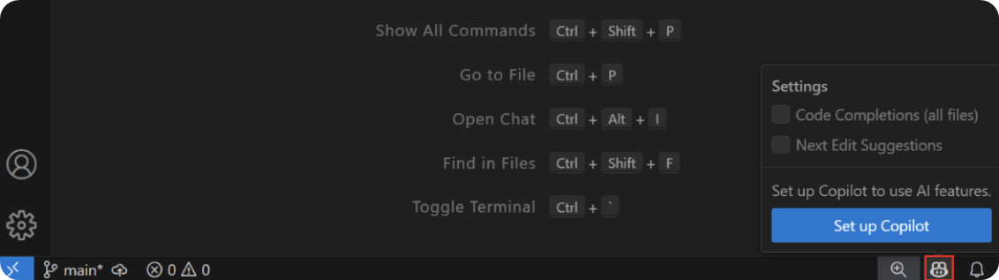
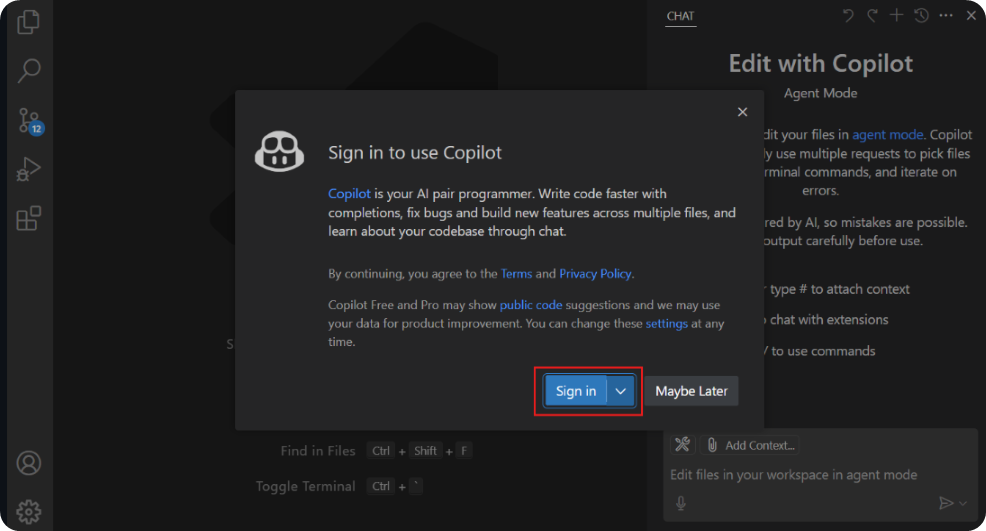

# How to Setup GitHub Copilot

GitHub Copilot supports a wide range of [development environments](#compatible-editors-and-platforms), with **the most comprehensive support in VSCode**. In addition, you can [use Copilot directly on GitHub.com](#), which provides a web-based experience for code review and exploration.

Let's walk you through everything you need to set up and start using GitHub Copilot, from prerequisites and subscription options to installation, usage tips, and troubleshooting.

## Prerequisites

!!! note "Prerequisites"
    Before you can use GitHub Copilot, you need to ensure you have the following prerequisites
    
    - A GitHub account with an active Copilot subscription associated with it
        1. Go to your GitHub account settings
        2. Navigate to "Billing and plans"
        3. Confirm your Copilot subscription is active
    - Compatible Editor or Platform
    - Active Internet Connection as it processes requests through GitHub's cloud services

## Installation instructions

=== "Visual Studio Code (Recommended)"
    Visual Studio Code offers the most comprehensive GitHub Copilot experience. It is installed by default, but you can also install it manually if needed.

    **Installation Steps:**

    1. Download and install [Visual Studio Code](https://code.visualstudio.com/)
    2. Open VS Code
    3. Go to the Extensions marketplace (Ctrl+Shift+X)
    4. Search for "GitHub Copilot"
    5. Click on the Copilot icon in the bottom right corner
    
    7. Sign in to your GitHub account when prompted
    

=== "Visual Studio"
    For Windows developers using Visual Studio:

    **Requirements:**
    - Visual Studio 2022 17.8 or later

    **Installation Steps:**
    
    1. Open Visual Studio
    2. Go to Extensions → Manage Extensions
    3. Search for "GitHub Copilot"
    4. Install the extension and restart Visual Studio
    5. Sign in to your GitHub account

=== "JetBrains IDEs"
    GitHub Copilot works across all major JetBrains IDEs:
    **Supported IDEs:**

    - IntelliJ IDEA
    - PyCharm
    - WebStorm
    - PhpStorm
    - RubyMine
    - CLion
    - GoLand
    - DataGrip
    - And more
    **Installation Steps:**

    1. Open your JetBrains IDE
    2. Go to File → Settings → Plugins (or IDE → Preferences → Plugins on macOS)
    3. Search for "GitHub Copilot" in the marketplace
    4. Install the plugin and restart your IDE
    5. Sign in to GitHub when prompted

=== "Other Editors"
    - **Neovim**: Install the [copilot.vim](https://github.com/github/copilot.vim) plugin
    - **Xcode**: Use [CopilotForXcode](https://github.com/github/CopilotForXcode)
    - **Eclipse**: Install from the [Eclipse Marketplace](https://marketplace.eclipse.org/content/github-copilot)

## Troubleshooting Common Issues

### Authentication Problems

**Issue**: "Not signed in to GitHub"

**Solution**:

1. Check your internet connection
2. Sign out and sign in again to GitHub in your editor
3. Clear your editor's authentication cache
4. Ensure your GitHub account has an active Copilot subscription

**Issue**: "GitHub Copilot could not connect to server"

**Solution**:

1. Check GitHub's status at [githubstatus.com](https://www.githubstatus.com/)
2. Verify your firewall isn't blocking GitHub connections
3. Try disconnecting and reconnecting your account

### Subscription Issues

**Issue**: "You don't have access to GitHub Copilot"

**Solution**:

1. Verify your subscription at github.com/settings/billing
2. If you're in an organization, check if they provide Copilot access
3. Ensure your payment method is valid for paid plans

### Performance Issues

**Issue**: Slow or no suggestions

**Solution**:

1. Check your internet connection speed
2. Restart your editor
3. Disable other AI-powered extensions that might conflict
4. Clear your editor's cache

### Extension Problems

**Issue**: Extension not working after installation

**Solution**:

1. Restart your editor completely
2. Check that all required extensions are installed
3. Update to the latest version of the extension
4. Check the extension's output panel for error messages

### Additional Resources

- [GitHub Copilot Documentation](https://docs.github.com/en/copilot)
- [GitHub Copilot Blog](https://github.blog/tag/github-copilot/)
- [GitHub Community Discussions](https://github.com/orgs/community/discussions)
- [VS Code Copilot Tips](https://code.visualstudio.com/docs/editor/github-copilot)

---